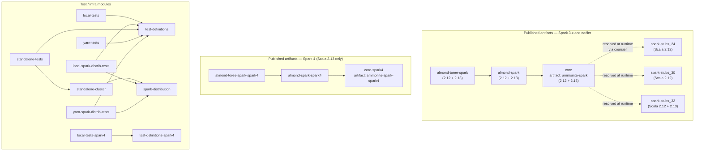
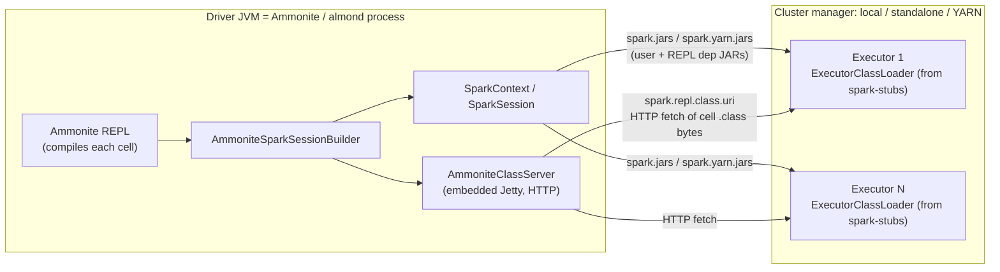
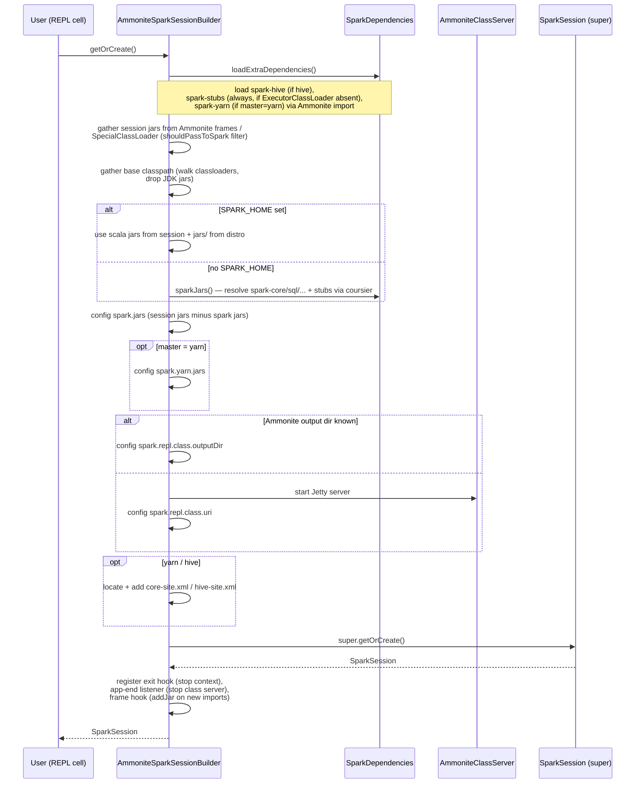
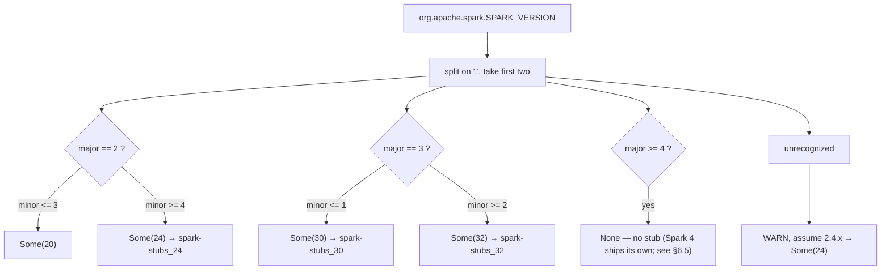

# ammonite-spark — Architecture

This document describes the architecture and internal structure of *ammonite-spark*, how it is
built, and how it supports multiple Spark versions — including Apache Spark 4 (see §6).

For a usage-oriented overview see [`README.md`](README.md); for the short internals note see
[`INTERNALS.md`](INTERNALS.md); for how to run the test suites see [`TESTS.md`](TESTS.md).

---

## 1. What the product does

*ammonite-spark* lets you create a `SparkSession` from an [Ammonite](http://ammonite.io/) REPL
(or an [almond](https://almond.sh/) Jupyter kernel) and drive Spark interactively, the way you
would from a `spark-shell`.

The crucial design decision is that **there is no Spark distribution involved** — no `SPARK_HOME`
is required (though one *can* be used). The Ammonite process *is* the Spark driver. Spark itself is
brought in by the user with an ordinary coursier/Ammonite dependency import:

```scala
@ import $ivy.`org.apache.spark::spark-sql:3.5.0`
@ import $ivy.`sh.almond::ammonite-spark:0.14.0-RC8`
@ val spark = AmmoniteSparkSession.builder().master("local[*]").getOrCreate()
```

The user calls `AmmoniteSparkSession.builder()` (or `NotebookSparkSession.builder()` in a
notebook) instead of Spark's own `SparkSession.builder()`. The returned builder *extends* Spark's
builder and adds the plumbing needed to make a REPL act as a distributed Spark driver:

- it works out which JARs on the REPL classpath must be shipped to the executors, and sets
  `spark.jars` / `spark.yarn.jars` accordingly;
- it exposes the classes that Ammonite compiles from each REPL cell to the executors, via
  `spark.repl.class.uri` (a small embedded web server) or `spark.repl.class.outputDir`;
- it supplies a small per-Spark-version shim (`spark-stubs_*`) that reimplements Spark's
  `org.apache.spark.repl.ExecutorClassLoader`, so executors can fetch those REPL-compiled classes
  (this applies to Spark ≤ 3; Spark 4 delivers REPL classes differently — see §6).

---

## 2. Module structure

The repository is a single [Mill](https://mill-build.org/) build (`build.mill`) with modules under
`modules/`. Publishable artifacts are published under the `sh.almond` organization.



The three `*-spark4` modules are a parallel, Scala-2.13-only build for Apache Spark 4 that coexists
with the Spark ≤ 3 artifacts under distinct names. They are documented in full in §6; the sections
below describe the original (Spark ≤ 3) modules.

### 2.1 `core` (published as `ammonite-spark`)

The heart of the product. Sources live under the package
`org.apache.spark.sql.ammonitesparkinternals` — deliberately inside Spark's own namespace so the
code can reach package-private Spark APIs. Public entry points live in `org.apache.spark.sql`.

| File | Responsibility |
|------|----------------|
| `AmmoniteSparkSession.scala` | Public object. `AmmoniteSparkSession.builder()` is the user entry point. Also holds the now-deprecated `sync()` (jars are now shipped automatically). |
| `ammonitesparkinternals/AmmoniteSparkSessionBuilder.scala` | The core logic. Extends `SparkSession.Builder`; overrides `getOrCreate()` to compute classpaths, load extra deps, start the class server, wire hooks, and configure the `SparkConf`. Since it must extend a source-incompatible builder across Spark majors, it is **version-specific**: the Spark ≤ 3 variant lives in `src-spark3/`, the Spark 4 variant in `src-spark4/` (see §6.3); everything else in `src/` is shared. |
| `ammonitesparkinternals/SparkDependencies.scala` | (shared) Detects which Spark modules are loaded, resolves the Spark jars via coursier, and selects the right `spark-stubs_*` artifact from `org.apache.spark.SPARK_VERSION` (returns `None` on Spark ≥ 4 — see §5.2 / §6.5). |
| `ammonitesparkinternals/AmmoniteClassServer.scala` | A tiny embedded Jetty server that serves REPL-compiled `.class` bytes to executors over HTTP. |
| `ammonitesparkinternals/Properties.scala` | Reads the generated `ammonite-spark.properties` (version + commit hash) baked into resources at build time. |

### 2.2 `spark-stubs_24` / `spark-stubs_30` / `spark-stubs_32`

Each stub module contains essentially two tiny classes:

- `org.apache.spark.repl.ExecutorClassLoader` — a reimplementation of Spark's own executor-side
  class loader, kept close to Spark's version *but retaining* the HTTP fetch path
  (`getClassFileInputStreamFromHttpServer`) that upstream Spark dropped. This is what lets
  executors pull REPL classes from `AmmoniteClassServer` over plain HTTP without Hadoop RPC.
- `spark.repl.Main` — a stub object that keeps Spark's `ClosureCleaner` happy.

The three variants exist because Spark's internals differ across major versions. The **only
substantive difference** between the three `ExecutorClassLoader` implementations is the shaded ASM
version used to rewrite REPL wrapper-class constructors:

| Stub module | ASM package | Targets Spark | Scala |
|-------------|-------------|---------------|-------|
| `spark-stubs_24` | `org.apache.xbean.asm6` | 2.4.x | 2.12 |
| `spark-stubs_30` | `org.apache.xbean.asm7` | 3.0.x – 3.1.x | 2.12 |
| `spark-stubs_32` | `org.apache.xbean.asm9` | 3.2.x – 3.5.x | 2.12 + 2.13 |

(There is also a historical `20` suffix referenced in code for Spark ≤ 2.3, but no `spark-stubs_20`
module is built in this repository.)

`spark-stubs_24`/`_30` are Scala 2.12-only (early Spark supported only 2.12/2.11);
`spark-stubs_32` is cross-built for 2.12 and 2.13.

### 2.3 `almond-spark`

Notebook integration for almond. Adds `NotebookSparkSession` (a builder that extends
`AmmoniteSparkSessionBuilder`) plus notebook-specific features:

- `ProgressSparkListener` / `StageElem` — live HTML progress bars in the notebook;
- `SendLog` / `SendLogToConsole` / `Log4jFile` / `Log4j2File` — forward Spark's log file into the
  notebook's developer console or kernel output (log4j 1.x for Spark ≤ 2, log4j2 for Spark 3+);
- `DataFrameRenderers` / `syntax` — render `DataFrame`s as HTML tables;
- automatically renders a "Spark UI" link (honoring reverse-proxy config).

### 2.4 `almond-toree-spark`

Thin layer on top of `almond-spark` adding [Toree](https://toree.apache.org/)-compatibility hooks
(`sh.almond::toree-hooks`), for notebooks written against the Toree Spark API.

### 2.5 Test and infrastructure modules

- `test-definitions` — the actual test cases (utest), written **once** and shared by every test
  runner module. This is where behavior tests live.
- `local-tests`, `local-spark-distrib-tests`, `standalone-tests`, `yarn-tests`,
  `yarn-spark-distrib-tests` — thin runner modules that depend on `test-definitions` and run it
  against a given cluster manager (see §5).
- `spark-distribution` / `standalone-cluster` — build helpers that download a real Spark
  distribution and spin up a standalone master + worker for the distribution/standalone tests.

---

## 3. Runtime architecture

At runtime there is one JVM that acts as the **driver** (the Ammonite / almond process) and any
number of **executors** brought up by the chosen cluster manager. The novel part is how driver-side
REPL state — user dependencies and freshly-compiled cell classes — reaches the executors.



Two distinct channels carry code to the executors:

1. **JARs** — dependencies imported in the session (Spark modules, `spark-stubs_*`, user libraries)
   are passed through `spark.jars` (and `spark.yarn.jars` for YARN). These are ordinary compiled
   artifacts.
2. **REPL-compiled classes** — each Ammonite cell is compiled into in-memory classes (`line$…$iw$`
   wrapper classes). These aren't in any JAR, so they're served on demand by `AmmoniteClassServer`
   over HTTP, and fetched by the `ExecutorClassLoader` from `spark-stubs_*` running on each
   executor. That stub loader also rewrites the wrapper-class constructors (with ASM) so that
   deserializing a closure on an executor doesn't re-run REPL initialization code.

### 3.1 The classpath computation (in `getOrCreate()`)

`AmmoniteSparkSessionBuilder.getOrCreate()` performs the following, roughly in order:



Notable details:

- **`shouldPassToSpark`** decides which classpath entries become `spark.jars`: real `.jar` files
  (not `-sources.jar`), including coursier "jar-in-jar" (`jar:file:…!/`) entries.
- **`isJdkJar`** filters out JDK jars (assumed present on executors).
- On Java 9+, the app classloader is no longer a `URLClassLoader`, so the builder reflectively
  reads `jdk.internal.loader.BuiltinClassLoader.ucp` to recover the launch classpath — which is why
  the tests pass a long list of `--add-opens` flags.
- A **frame hook** is registered so that any `import $ivy.…` done *after* the session is created
  automatically `sc.addJar`s the new dependency (this replaced the old manual `sync()` call).

---

## 4. Build process

The build uses **Mill** driven through the checked-in `./mill` launcher.

- `build.mill` — module definitions. Header pins `mill-version` and `mill-jvm-version: 17`.
- `mill-build/src/ammsparkbuild/` — reusable build logic:
  - `Versions.scala` — pinned Scala (2.12.11 / 2.13.11), Ammonite, almond, jsoniter versions.
  - `Deps.scala` — dependency coordinates, including which Spark version each module compiles
    against.
  - `SparkHome.scala` — downloads a lightweight Spark distribution and swaps Spark's `spark-repl`
    jar for our stub jar (used by the distribution/standalone tests).
  - `StandaloneCluster.scala` — starts/stops a standalone master + worker.
  - `RunClasspathAsJars.scala` — repackages classpath *directories* into JARs, because
    `sc.addJar` rejects directory entries (used by the YARN test modules).
- `mill-build/src/mill/MillCsHelper.scala` — helper to root the modules under `modules/`.

Key build traits (in `build.mill`):

- `AmmSparkPublishModule` — publishing metadata; compiles Java with `--release 8` so the artifacts
  run on Java 8+.
- `AmmSparkMima` — binary-compatibility checking via [MiMa](https://github.com/lightbend/mima)
  against previous released versions (`v0.9.0`+ for 2.12, `v0.13.0`+ for 2.13).
- `WithPropertyFile` — generates `ammonite-spark.properties` (version + git commit) into resources.
- `WithDependencyResourceFile` — writes the resolved dependency list into a resource used by tests.
- `SparkTestsJvm` — forces Spark-hosting modules to run on **Java 11** (`temurin:11`), because
  Spark 3.x doesn't officially support Java 17; the build itself runs on Java 17.
- `AmmSparkTests` — utest framework + the `--add-opens` fork args Spark needs on Java 11+, and
  points `COURSIER_REPOSITORIES` at a local repo of the just-built artifacts.

Versioning is derived from git tags via `VcsVersion` (overridable with
`AMMONITE_SPARK_FORCED_VERSION`). Current release line is `0.14.0-RCx`.

Common commands:

```bash
./mill __.compile                     # compile everything
./mill __.mimaReportBinaryIssues      # binary-compatibility check
cs launch scalafmt -- --check         # formatting (scalafmt 3.9.6, scala3 dialect)
./mill mill.scalalib.SonatypeCentralPublishModule/   # publish (CI, on push)
```

CI (`.github/workflows/ci.yml`) runs four jobs: a `test` matrix over
`local | standalone | yarn | local-distrib | yarn-distrib` (via `.github/scripts/test.sh`), a
`checks` job (mill-checks for empty/orphan sources), a `format` job, and a `publish` job on push.

### Test artifact flow

The tests resolve the *just-built* artifacts rather than published ones. `build.mill`'s `testRepo`
task gathers every publish module's `publishLocalTestRepo` into a single local Maven repo, and the
test modules set `COURSIER_REPOSITORIES` to that repo (plus Central). Inside the embedded Ammonite
REPL used by the tests, `import $ivy.\`sh.almond::ammonite-spark:…\`` then resolves those artifacts,
which in turn pull the matching `spark-stubs_*` dynamically through coursier.

---

## 5. How different Spark versions are supported

Support for multiple Spark versions rests on three mechanisms:

### 5.1 Spark itself is user-provided

`core` only *compiles* against a Spark version (chosen in `Deps.scala`: `spark-sql:2.4.0` for Scala
2.12, `3.2.0` for 2.13), using stable/public-enough APIs. At runtime the actual Spark version is
whatever the user imported. `core` reads `org.apache.spark.SPARK_VERSION` to adapt its behavior.

### 5.2 Runtime version detection → stub selection

The single most version-sensitive piece of logic is `SparkDependencies.stubsDependencyOpt`, which maps
the running Spark version to an **optional** stub artifact (`Option[Dependency]`):



When `stubsDependencyOpt` is `Some(...)`, the stub is loaded into the session (`interpApi.load.ivy(...)`)
if no executor-side class loader is already present — the detection recognizes both
`org.apache.spark.repl.ExecutorClassLoader` (Spark ≤ 3) and `org.apache.spark.executor.ExecutorClassLoader`
(Spark 4, in spark-core). `spark-hive` and `spark-yarn` are likewise pulled at their matching
`SPARK_VERSION` on demand.

On Spark ≥ 4 `stubsDependencyOpt` is `None`: Spark 4 ships its own executor class loader and no
`spark-stubs_40` exists or is needed (see §6.5). The `case _` fallback still assumes 2.4.x for any
*other* unrecognized version.

### 5.3 A few other version-conditioned code paths

- `AmmoniteClassServer.uri` appends a trailing `/` for Spark binary version ≥ 3.2 (URI handling
  changed in Spark).
- `NotebookSparkSessionBuilder` picks log4j 1.x vs log4j2 based on whether `SPARK_VERSION` starts
  with `1.`/`2.` vs `3+`.
- `confEnvVars` derives an env-var name suffix from the Spark binary version.

### 5.4 The compatibility contract

The Spark version imported in the session must match the Scala version of the imported
`ammonite-spark`/stubs (2.12 vs 2.13), and — for external clusters — the cluster's Spark and Scala
versions. The `README.md` compatibility table maps ammonite-spark ↔ Ammonite ↔ almond versions.

---

## 6. Spark 4 support

Apache Spark 4 **is supported**, via a dedicated set of Scala-2.13-only modules
(`*-spark4`) that are built and published alongside — and independently of — the existing
Spark ≤ 3 artifacts. This section documents the design and every change made to add it.

The support is verified against **Spark 4.0.3** and is built against the versions almond 0.14.5
uses: **Scala 2.13.16**, **Ammonite `com.lihaoyi:3.0.8`**, **almond 0.14.5** (see §6.7).

| | Spark ≤ 3 build | Spark 4 build |
|---|---|---|
| Scala | 2.12 + 2.13 (2.13.11) | 2.13 only (2.13.16) |
| Ammonite | `sh.almond.tmp.ammonite` fork | upstream `com.lihaoyi:3.0.8` |
| almond | 0.14.0-RC13 | 0.14.5 |
| Java | 8 / 11 | 17 or 21 |
| Published artifacts | `ammonite-spark`, `almond-spark`, `almond-toree-spark` | `ammonite-spark-spark4`, `almond-spark-spark4`, `almond-toree-spark-spark4` |
| REPL classes → executors | HTTP (`AmmoniteClassServer`) + `spark-stubs_*` | `spark.repl.class.outputDir` + Spark's own class loader (no stub) |

### 6.1 What changed in Spark 4 (and why it needs separate modules)

Three Spark-4 changes break the assumptions the Spark ≤ 3 code paths are built on:

1. **The `SparkSession` API was split.** `org.apache.spark.sql.SparkSession` is now an *abstract*
   class in the `sql-api` module; the concrete, driver-backed implementation is
   `org.apache.spark.sql.classic.SparkSession` (with Spark Connect as a second implementation).
   Only the **classic** builder actually creates a local/driver session — the api builder's
   `getOrCreate()` merely delegates. Additionally, the builder's `options` map moved from a private
   field on `SparkSession.Builder` to a `protected val` on the new
   `org.apache.spark.sql.SparkSessionBuilder` superclass.

2. **The executor-side class loader moved and lost HTTP.** `ExecutorClassLoader` moved from
   `org.apache.spark.repl` (the `spark-repl` jar) to `org.apache.spark.executor` (in `spark-core`),
   and its `fetchFn` dropped the `http`/`https`/`ftp` cases — it now supports only the `spark://`
   RPC scheme and Hadoop `FileSystem`. The whole `spark-stubs_*` mechanism (shadow
   `org.apache.spark.repl.ExecutorClassLoader`, keep an HTTP fetch path) is therefore inert on
   Spark 4.

3. **Scala 2.12 is gone; Java 17 is required.** Spark 4 publishes only `_2.13` artifacts (built
   against 2.13.16) and requires Java 17/21.

Because (1) makes the builder source-incompatible across Spark majors and (3) forces a different
Scala/JVM, Spark 4 cannot be a runtime-only adaptation of the existing artifacts (as Spark 3.0→3.5
was) — it needs its own compilation. Hence a parallel module set rather than another entry in the
Scala-version cross of `core`.

### 6.2 Module topology

Five new modules, all Scala-2.13-only. The three published ones and `test-definitions-spark4`
compile on Java 17 (`temurin:17`, via the `Spark4Jvm` build trait); `local-tests-spark4` is a cross
that runs on **both Java 17 and 21** (Spark 4 supports both). They carry `-spark4` artifact names so
they coexist with the Spark ≤ 3 artifacts:

| Module | Publishes | Depends on | Notes |
|--------|-----------|------------|-------|
| `core-spark4` | `ammonite-spark-spark4` | `spark-sql:4.0.0` (provided; compile target — see §6.7), upstream Ammonite | shared `core/src` + `core/src-spark4` |
| `almond-spark-spark4` | `almond-spark-spark4` | `core-spark4`, `scala-kernel-api:0.14.5` (provided) | shared `almond-spark/src` + `src-spark4` |
| `almond-toree-spark-spark4` | `almond-toree-spark-spark4` | `almond-spark-spark4`, `toree-hooks:0.14.5` | reuses `almond-toree-spark/src` unchanged |
| `test-definitions-spark4` | — (test) | — | reuses `test-definitions/src` + resources unchanged |
| `local-tests-spark4` | — (test) | `test-definitions-spark4` | runs the shared suite against Spark 4.0.3 on `local[*]`, Java 17 & 21 |
| `yarn-tests-spark4` | — (test) | `test-definitions-spark4` | YARN counterpart; currently a disabled stub (see §6.8) |

Spark itself is `provided`/`compileMvnDeps` (user- or orchestrator-supplied at runtime), exactly as
in the Spark ≤ 3 modules. The three published `*-spark4` modules are gathered by a dedicated
`testRepoSpark4` task (separate from the Spark ≤ 3 `testRepo`, so neither test track builds the
other's modules — see §6.9).

### 6.3 Source layout: shared vs. version-specific

The only file that genuinely differs between Spark majors is the session builder (its `extends`
clause and one reflection site). Rather than duplicate the ~640-line builder, `core` and
`almond-spark` were split into a shared root plus per-version roots:

```
modules/core/src/            # shared: AmmoniteSparkSession, SparkDependencies, AmmoniteClassServer, Properties
modules/core/src-spark3/     # Spark <= 3: AmmoniteSparkSessionBuilder (extends org.apache.spark.sql.SparkSession.Builder)
modules/core/src-spark4/     # Spark 4:    AmmoniteSparkSessionBuilder (extends the classic builder)

modules/almond-spark/src/         # shared: NotebookSparkSession, renderers, ProgressSparkListener, log/util helpers
modules/almond-spark/src-spark3/  # Spark <= 3: NotebookSparkSessionBuilder + Log4jFile (log4j 1.x)
modules/almond-spark/src-spark4/  # Spark 4:    NotebookSparkSessionBuilder (log4j2 only)
```

Each module lists its source roots explicitly via `Task.Sources(...)`: `core` compiles `src` +
`src-spark3`, `core-spark4` compiles `src` + `src-spark4` (and likewise for `almond-spark`). The
shared sources compile unchanged against both Spark 3.2 and Spark 4 because they only touch stable,
api-level Spark types (`SparkContext`, `SparkSession`, `SPARK_VERSION`, scheduler events) and refer
to version-specific class names as strings.

### 6.4 The Spark-4 session builder (`core/src-spark4`)

Three deltas versus the Spark ≤ 3 builder:

- **Extends the classic builder.** `class AmmoniteSparkSessionBuilder extends
  org.apache.spark.sql.classic.SparkSession.Builder`, and `getOrCreate()` returns a
  `classic.SparkSession`. (The Spark ≤ 3 variant extends `org.apache.spark.sql.SparkSession.Builder`.)
- **`options` reflection walks the class hierarchy.** The builder reads Spark's `options` map by
  reflection to inspect user-set config. In Spark 4 that field is on the `SparkSessionBuilder`
  *superclass*, so the lookup now walks up `getClass`'s superclasses (rather than calling
  `getDeclaredField` on the builder class), trying `options` first then the legacy
  `org$apache$spark$sql$SparkSession$Builder$$options`. This is robust across the hierarchy.
- **Requires an output directory instead of the HTTP class server.** Because Spark 4's executor
  class loader can't fetch over HTTP (§6.1), the Spark-4 builder does not start `AmmoniteClassServer`.
  Instead it requires `interpApi._compilerManager.outputDir` to be set and configures
  `spark.repl.class.outputDir` from it; if it is absent it fails fast with an actionable message
  (asking to relaunch with `--tmp-output-directory`). Spark's own driver class-file server then
  serves those classes to executors over the `spark://` RPC scheme, and Spark's own
  `org.apache.spark.executor.ExecutorClassLoader` does the constructor-cleaning the stub used to do.

  In practice this "just works" in a REPL/notebook: Ammonite's `--tmp-output-directory` and almond
  ≥ 0.14 (which creates a temp output directory by default) both set `outputDir`, so no user action
  is normally needed.

### 6.5 Dependency/stub handling (`core/src/SparkDependencies.scala`, shared)

`SparkDependencies` was made Spark-4-aware without breaking the Spark ≤ 3 behavior:

- A new **`stubsDependencyOpt: Option[Dependency]`** holds the version→stub mapping and yields
  **`None` for Spark ≥ 4** (see the flowchart in §5.2). There is intentionally **no `spark-stubs_40`**:
  Spark 4 already ships a working `org.apache.spark.executor.ExecutorClassLoader` in `spark-core`, and
  the `outputDir`/`spark://` path needs no shadow class loader.
- The pre-existing **`stubsDependency: Dependency`** keeps its original signature and is retained as
  a thin wrapper (`stubsDependencyOpt.getOrElse(sys.error(…))`). That matters because this class is
  covered by MiMa: changing the published method's result type to `Option[Dependency]` is a
  binary-incompatible change for the Spark ≤ 3 `ammonite-spark` artifact. On Spark ≤ 3 — the only
  Spark that artifact supports — the option is always `Some`, so the wrapper never errors.
- The "is an executor class loader already present?" probe recognizes **both**
  `org.apache.spark.repl.ExecutorClassLoader` (≤ 3) and `org.apache.spark.executor.ExecutorClassLoader`
  (4), so the stub-loading step is skipped on Spark 4.
- `sparkBaseDependencies()` appends the stub via `stubsDependencyOpt.toSeq`, so the base classpath
  computation no longer forces a (nonexistent) `spark-stubs_*_2.13` on Spark 4.

The Spark-4 builder's `loadExtraDependencies()` iterates `stubsDependencyOpt` as an `Option`, so it is
a no-op on Spark 4. (The Spark ≤ 3 builder was updated the same way — behavior-preserving there.)

### 6.6 Notebook layer (`almond-spark` / `almond-toree-spark`)

- **`NotebookSparkSessionBuilder`** is split like the core builder: the Spark-4 variant extends the
  classic-typed `AmmoniteSparkSessionBuilder` (so `getOrCreate()` returns `classic.SparkSession`)
  and always uses log4j2 for its "forward Spark logs to the notebook" feature.
- **`Log4jFile`** (the log4j 1.x reflection helper) is Spark ≤ 3 only — Spark 4 ships no log4j 1.x —
  so it moved to `almond-spark/src-spark3/`. `Log4j2File` is shared.
- **Renderers, `ProgressSparkListener`, `SendLog`/`SendLogToConsole`, `NotebookSparkSession`** are
  unchanged and shared: they use only api-level Spark. In particular `DataFrameRenderer` relies on
  `Dataset.rdd` / `Dataset.schema` and the `type DataFrame = Dataset[Row]` alias, all present in
  Spark 4's `sql-api`.
- **`almond-toree-spark`**: its single source (`ToreeSql`) is Spark-agnostic, so
  `almond-toree-spark-spark4` reuses it unchanged and only re-targets the dependency on the Spark-4
  almond module.

### 6.7 Version alignment (Scala 2.13.16 / Ammonite 3.0.8 / almond 0.14.5)

The Spark-4 modules are built against the versions almond 0.14.5 uses, so the shipped artifacts are
binary-compatible with an almond 0.14.5 / Scala 2.13.16 runtime:

- **Scala 2.13.16** — the version Spark 4.0.3 is built against, and the only 2.13.x for which almond
  0.14.5 is published.
- **Ammonite `com.lihaoyi:3.0.8`** — *upstream* Ammonite, not the `sh.almond.tmp.ammonite` fork the
  Spark ≤ 3 build pins. almond 0.14.5 uses upstream 3.0.8. The builder/notebook code and the test
  harness (`TestRepl`) all compiled against 3.0.8 with no source changes — the Ammonite APIs used
  (`InterpAPI._compilerManager.outputDir`, `repositories`/`resolutionHooks`/`beforeExitHooks`,
  `ReplAPI.sess.frames`, `Frame`/`Frame.Hook`, `Interpreter`/`Interpreter.Parameters`,
  `SessionApiImpl`, `Printer`, `CompilerBuilder`) are compatible between the fork and 3.0.8.
- **almond 0.14.5** — `scala-kernel-api` and `toree-hooks`.

These are held in `Versions.scala` as `scala213Spark4` / `ammoniteSpark4` / `almondSpark4` and in
`Deps.scala` as the `*Spark4` dependency accessors, leaving the Spark ≤ 3 pins untouched.

### 6.8 Test infrastructure

- **`test-definitions-spark4`** compiles the *shared* `test-definitions` sources and resources
  against Scala 2.13.16 + upstream Ammonite 3.0.8, so the embedded `TestRepl` exercises the same
  Ammonite the shipped artifacts run against. `TestRepl` required **no changes** for 3.0.8.
- **`local-tests-spark4`** runs the shared `SparkReplTests` suite against Spark 4 on `local[*]`.
  It is a cross over JDK major (`spark4TestJvmIds = Seq("17", "21")`, `jvmId = s"temurin:$crossValue"`),
  so `./mill local-tests-spark4._.testForked` exercises **both Java 17 and 21** (Spark 4's supported
  JDKs). The Spark version comes from the same `AMMSPARK_SPARK_VERSION` contract the Spark ≤ 3 test
  modules use — supplied by `Spark4Tests` from a `Task.Input` defaulting to `Versions.spark4Test`
  (`4.0.3`) — since here the cross dimension is the JDK, not the Spark version. Its embedded REPL
  resolves `spark-sql:<that version>` and `ammonite-spark-spark4` from `testRepoSpark4 | central`
  (see §6.9).
- **`yarn-tests-spark4`** is the YARN counterpart, but — exactly like the Spark 3.2 YARN cross values —
  its actual test (`Yarn40Tests`) is a **disabled empty stub** (the real `SparkReplTests("yarn", …)`
  is present but commented out). The dockerized YARN test cluster is still hadoop-2.7, and Spark ≥
  3.2 (hence Spark 4) needs hadoop 3; the module is fully wired so enabling it is just uncommenting
  once the cluster is upgraded. The Spark-4 builder retains the full YARN plumbing, so this is a
  test-infra gap, not a code gap.
- **Shared test-code changes** (in `test-definitions`, kept working for all Spark versions):
  - `Init.init` / `Init.scriptInit` take an `ammoniteSparkArtifact` parameter (default
    `ammonite-spark`) so the Spark-4 tests import `ammonite-spark-spark4`.
  - `SparkReplTests` gained an overridable `ammoniteSparkArtifact` and a `datasetType` helper: Spark 4
    renders a typed `Dataset` as `classic.Dataset[…]` (the concrete class moved to
    `org.apache.spark.sql.classic`), so the "Datasets and encoders" expectation is version-aware.
  - `Local40Tests` takes its Spark version from `Versions.sparkVersion` (the shared
    `AMMSPARK_SPARK_VERSION` accessor) and overrides `ammoniteSparkArtifact`.

### 6.9 Build & test notes

- **JVM.** The published Spark-4 modules compile on `temurin:17` (`Spark4Jvm`); `local-tests-spark4`
  is a cross that runs the suite on both Java 17 and 21. The compiled bytecode targets an older
  release, so the artifacts run unchanged on any of Spark 4's supported JDKs (17 / 21) — the JVM
  options a Spark 4 driver needs are the consumer's launch responsibility. The Spark-4 test fork
  reproduces Spark 4's full `JavaModuleOptions.DEFAULT_MODULE_OPTIONS`: the `--add-opens` set lives
  in the shared `AmmSparkTests.forkArgs` (it now includes `java.base/jdk.internal.ref`), and the
  three remaining options — `--add-modules=jdk.incubator.vector`,
  `-Djdk.reflect.useDirectMethodHandle=false`, `-Dio.netty.tryReflectionSetAccessible=true` — are
  added only in `local-tests-spark4` (they can't go in the shared set: `jdk.incubator.vector` doesn't
  exist before Java 16 and would break the Java-11 Spark ≤ 3 test forks). Without
  `-Djdk.reflect.useDirectMethodHandle=false`, reflection-driven REPL output differs on Java 21 vs 17
  and the output-comparison tests fail.
- **Decoupled test repos.** `testRepo` (Spark ≤ 3 artifacts) and `testRepoSpark4` (the three
  `*-spark4` artifacts) are separate Mill tasks. `AmmSparkTests.testArtifactsRepo` defaults to
  `testRepo`; the Spark-4 test modules (via the `Spark4Tests` trait) override it to `testRepoSpark4`.
  So a Spark ≤ 3 test build never has to build (and resolve) the Spark 4 modules — which need Java 17
  and a Spark 4 / Ammonite 3.0.8 toolchain — and vice versa.

### 6.10 Scope and follow-ups

- **Verified:** `local-tests-spark4` (the full shared `SparkReplTests` suite) passes against Spark
  4.0.3 on `local[*]`, on **both Java 17 and 21** — session creation, RDD/closure execution, and
  REPL-class delivery via the `outputDir`/RPC path all work with the classic builder and no stub.
  The modules are **compiled against Spark 4.0.0** (the oldest 4.x) but tested on 4.0.3, which also
  demonstrates the 4.0.0-compiled artifacts run on a newer 4.0.x.
- **Forward-compatible with 4.1.x / 4.2.x:** the 4.0.0-compiled artifacts were checked against the
  Spark **4.1.3** and **4.2.0** releases — every Spark symbol the bytecode binds to is present with a
  matching signature in both: the `org.apache.spark.sql.classic.SparkSession.Builder` hierarchy (it
  still `extends SparkSessionBuilder`) and its `getOrCreate`, the `SparkSessionBuilder.options` field
  read by reflection (still a `private final HashMap`), `org.apache.spark.executor.ExecutorClassLoader`,
  `Dataset.rdd`/`schema`, the `DataFrame = Dataset[Row]` alias, and `SparkContext`'s handling of
  `spark.repl.class.outputDir`. The full shared `SparkReplTests` suite also runs green against both
  4.1.3 and 4.2.0 on Java 21. To exercise a specific runtime, set `AMMSPARK_SPARK_VERSION`,
  e.g. `AMMSPARK_SPARK_VERSION=4.1.3 ./mill 'local-tests-spark4[21].testForked'`.
  Note that Spark's **driver JVM module-options grow across 4.x minors** (4.1 adds
  `--enable-native-access=ALL-UNNAMED` plus two netty `-D` flags; 4.2 additionally adds
  `--sun-misc-unsafe-memory-access=allow` for JDK 24+ and drops `-Djdk.reflect.useDirectMethodHandle=false`).
  These are the launching process's responsibility — each Spark version ships its own
  `JavaModuleOptions.DEFAULT_MODULE_OPTIONS` — and are not baked into the artifacts, so they do not
  affect artifact compatibility; a consumer just supplies the set matching its Spark version.
- **Not yet covered:** the distribution / standalone / YARN test paths for Spark 4. `yarn-tests-spark4`
  exists but its test is a disabled stub pending a hadoop-3 dockerized YARN cluster (§6.8); the
  distribution/standalone paths need a Spark 4 download (`SparkHome.scala` and the
  `sparkVersions`/`scalaVersions`/`jvmIds` maps still target older Spark, e.g. `2.4.2`,
  `hadoop2.7-scala2.12`).
- **Not applicable:** Scala 2.12 (Spark 4 is 2.13-only, by design).
- **Pending:** the `README.md` compatibility table does not yet list the Spark 4 / `*-spark4`
  artifacts.
