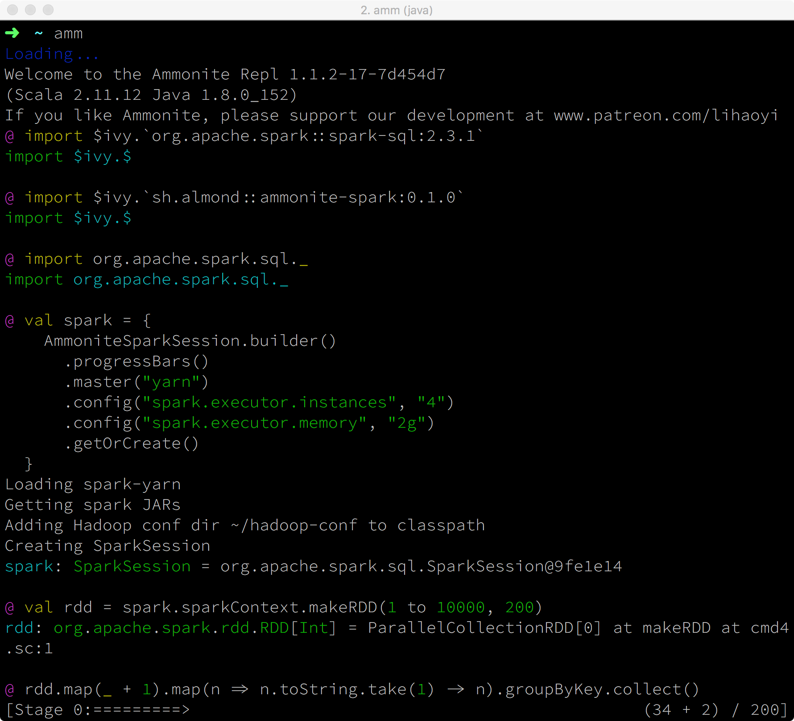

# ammonite-spark

Run [spark](https://spark.apache.org/) calculations from [Ammonite](http://ammonite.io/)

[](https://travis-ci.org/alexarchambault/ammonite-spark)

*ammonite-spark* allows to create SparkSessions from Ammonite. It passes some Ammonite internals to a `SparkSession`, so that spark calculations can be driven from Ammonite, as one would do from a [spark-shell](https://spark.apache.org/docs/2.3.1/quick-start.html#interactive-analysis-with-the-spark-shell).



## Table of content

1. [Quick start](#quick-start)
2. [`AmmoniteSparkSession` vs `SparkSession`](#ammonitesparksession-vs-sparksession)
   1. [Syncing dependencies](#syncing-dependencies)
3. [Using with standalone cluster](#using-with-standalone-cluster)
4. [Using with YARN cluster](#using-with-yarn-cluster)
5. [Missing](#missing)


## Quick start

Start Ammonite >= [`1.1.2-17-7d454d7`](https://github.com/lihaoyi/Ammonite/releases/download/1.1.2/2.11-1.1.2-17-7d454d7), with the `--class-based` option. Either follow [the instructions](http://ammonite.io/#Ammonite-REPL) on its website, then do
```
$ amm --class-based
```
or use [coursier](https://github.com/coursier/coursier),
```
$ coursier launch com.lihaoyi:ammonite_2.11.12:1.1.2-17-7d454d7 -M ammonite.Main -- --class-based
```
In both cases, ensure you are using scala 2.11.x.

At the Ammonite prompt, load the Spark 2.x version of your choice, along with ammonite-spark,
```scala
@ import $ivy.`org.apache.spark::spark-sql:2.3.1`
@ interp.repositories() = interp.repositories() :+ coursier.MavenRepository("https://oss.sonatype.org/content/repositories/snapshots")
@ import $ivy.`sh.almond::ammonite-spark:0.0.1+7-cea71a49-SNAPSHOT`
```

Then create a `SparkSession` using the builder provided by *ammonite-spark*
```scala
@ import org.apache.spark.sql._

@ val spark = {
    AmmoniteSparkSession.builder()
      .master("local[*]")
      .getOrCreate()
  }
```

Note the use of `AmmoniteSparkSession.builder()`, instead of `SparkSession.builder()` that one would use when e.g. writing a Spark job.

The builder returned by `AmmoniteSparkSession.builder()` extends the one of `SparkSession.builder()`, so that one can call `.appName("foo")`, `.config("key", "value")`, etc. on it.

See below for how to use it with [standalone clusters](#using-with-standalone-cluster), and how to use it with [YARN clusters](#using-with-yarn-cluster).

Note that *ammonite-spark* does *not* rely on a Spark distribution. The driver and executors classpaths are handled from the Ammonite session only, via ``import $ivy.`…` `` statements. See [INTERNALS](https://github.com/alexarchambault/ammonite-spark/blob/develop/INTERNALS.md) for more details.

You can then run Spark calculations, like
```scala
@ def sc = spark.sparkContext

@ val rdd = sc.parallelize(1 to 100, 10)

@ val n = rdd.map(_ + 1).sum()
```

### Syncing dependencies

If extra dependencies are loaded, via ``import $ivy.`…` `` after the `SparkSession` has been created, one should call `AmmoniteSparkSession.sync()` for the newly added JARs to be passed to the Spark executors.

## Using with standalone cluster

Simply set the master to `spark://…` when building the session, e.g.
```scala
@ val spark = {
    AmmoniteSparkSession.builder()
      .master("spark://localhost:7077")
      .config("spark.executor.instances", "4")
      .config("spark.executor.memory", "2g")
      .getOrCreate()
  }
```

Ensure the version of Spark used to start the master and executors matches the one loaded in the Ammonite session (via e.g. ``import $ivy.`org.apache.spark::spark-sql:X.Y.Z` ``), and that the machine running Ammonite can access / is accessible from all nodes of the standalone cluster.

## Using with YARN cluster

Set the master to `"yarn"` when building the session, e.g.
```scala
@ val spark = {
    AmmoniteSparkSession.builder()
      .master("yarn")
      .config("spark.executor.instances", "4")
      .config("spark.executor.memory", "2g")
      .getOrCreate()
  }
```

Ensure the configuration directory of the cluster is set in `HADOOP_CONF_DIR` or `YARN_CONF_DIR` in the environment, or is available at `/etc/hadoop/conf`. This directory should contain files like `core-site.xml`, `hdfs-site.xml`, … Ensure also that the machine you run Ammonite on can indeed act as the driver (it should have access to and be accessible from the YARN nodes, etc.).

Before raising issues, ensure you are aware of all that needs to be set up to get a working spark-shell from a Spark distribution, and that all of them are passed in one way or another to the SparkSession created from Ammonite.

## Missing

Local clusters, Mesos, and Kubernetes, aren't supported yet.

No scala 2.10 support (it was dropped by Ammonite).
